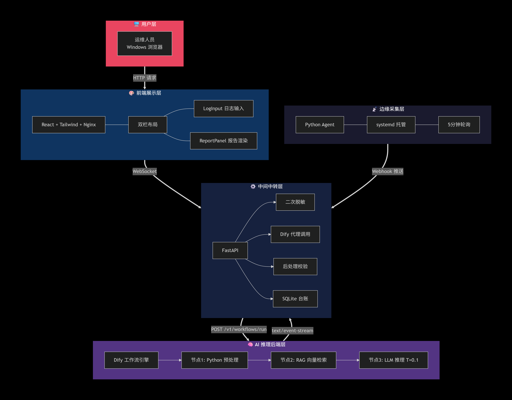

# FA 智能诊断系统 · FA Hardware Fault Diagnosis System

> 基于大语言模型（LLM）的 x86 Linux 服务器硬件故障智能诊断系统。
> 通过「RAG 知识库约束 + 低温大模型推理 + 代码层后处理硬拦截」三重防幻觉架构，
> 从原始日志（dmesg / mcelog / IPMI SEL）自动输出**结构化、插槽级精确定位**的失效分析（FA）诊断报告。

[English summary](#english-summary) · [架构设计](docs/架构设计.md) · [综合技术报告](docs/技术报告.md) · [部署与测试报告](docs/部署与测试报告.md) · [离线部署手册](docs/离线部署手册.md)

---

## ✨ 核心特性

- **三重防幻觉（工业级可靠）**：`Temperature=0.1` 低温采样 → 四段式 Prompt 强约束 → FastAPI 代码层后处理**硬拦截**（缺失自动补全、未标注溯源强制警示、知识库无匹配强制兜底）。知识库无匹配场景下 AI 编造内容拦截率 100%。
- **插槽级精准定位**：故障结论精确到物理插槽（如 `Channel 2, DIMM 3`、`CPU 0 Bank 4`），前端自动红色加粗放大，运维直接带备件换件，打通「诊断—处置」最后一公里。
- **三层降级日志解析**：通用正则（≥95%）→ 关键词兜底（≥85%）→ LLM 语义理解（70~80%），覆盖 Dell / HPE / 华为等厂商标准与私有格式，对未知格式具备「不断线」解析韧性。
- **9 大类硬件覆盖**：CPU、内存、散热（温度/风扇）、存储（硬盘）、电源、网络（网卡）、PCIe、主板、BMC。
- **分钟级流式诊断**：日志输入到报告输出 5~15 秒，打字机效果流式渲染。
- **全离线极简私有化部署**：一条命令完成中心端部署，零外部网络依赖，适配国企内网；支持内网全离线版（内置 Ollama 本地模型）与公网版（在线 API）双部署包。
- **双模式日志输入**：运维手动粘贴 + Python Agent 自动采集（systemd 托管、5 分钟轮询）。

---

## 🏗️ 系统架构

系统采用**五层解耦模型**：

```
用户层 (Windows 浏览器)
   │
前端展示层  React + Tailwind + Nginx（双栏：日志输入 / 报告渲染）
   │
中间中转层  FastAPI（安全隔离 · 日志二次脱敏 · Dify 代理 · 后处理校验）
   │
AI 推理后端层  Dify 工作流（预处理 → RAG 检索 → LLM 推理，SSE 流式）
   │
边缘采集层  Python Agent（仅此一种采集模式，部署在被管服务器）
```



> 完整架构、容器编排与数据闭环见 [docs/架构设计.md](docs/架构设计.md)；端到端数据流转见 [docs/assets/dataflow.png](docs/assets/dataflow.png)。

**技术栈**

| 层 | 选型 |
|----|------|
| 工作流引擎 | Dify 1.15.0（可视化编排 + 内置 RAG/Weaviate + SSE 流式） |
| 大模型 | DeepSeek / GLM-4 / Qwen-2.5（在线 API）或 Qwen2-7B + nomic-embed-text（Ollama 本地） |
| 向量库 | Weaviate（Dify 内置） |
| 后端 | FastAPI（原生异步 + WebSocket，适合流式） |
| 前端 | React + Vite + Tailwind |
| 数据库 | SQLite（单机 WAL 模式） / PostgreSQL（Dify 元数据） |
| 采集 Agent | Python 3.6+（无重型依赖，systemd 托管） |

---

## 🚀 快速开始

### 方式一：Docker 一键部署（推荐，生产/演示）

面向全新 Ubuntu 20.04/22.04/24.04 服务器，提供**内网离线版**与**公网版**双部署包：

```bash
# 内网离线版：把 <服务器公网IP> 换成实际 IP
cd /opt
sudo bash install-all.sh <服务器公网IP>

# 公网版
mkdir -p /opt/fa && tar -xzf fa-diagnosis-public.tar.gz -C /opt/fa
cd /opt/fa && sudo bash deploy/install-public.sh --skip-confirm
```

部署后访问：FA 前端 `http://<IP>:3000`、Dify 控制台 `http://<IP>:80`、FA 后端 `http://<IP>:8000`。
完整前置检查、初始化、Agent 部署、排错见 [docs/离线部署手册.md](docs/离线部署手册.md)。

### 方式二：本地开发（源码）

```bash
# 后端
python -m venv .venv && source .venv/Scripts/activate   # Windows
pip install -r backend/requirements.txt
uvicorn main:app --host 0.0.0.0 --port 8000 --reload

# 前端
cd frontend && npm install && npm run dev
```

> 本地开发需自行准备 Dify 工作流与知识库（见 [dify/workflow](dify/workflow) 与 [dify/knowledge-base](dify/knowledge-base)）。

---

## 📋 诊断报告示例（四段式）

系统对每一次诊断强制输出如下四段式 Markdown 报告：

```markdown
### 【故障现象定位】
- 故障部件：内存
- 物理位置：Channel 2, DIMM 3
- 报错代码：0x0005
- 故障等级：严重（UE）

### 【物理根因推导】
判断为内存颗粒内部缓存奇偶校验失败导致的不可纠正错误（UE）。[依据：服务器内存故障判定与处置规范.md]

### 【工程处置建议】
1. 紧急处置：将该服务器从业务集群中摘除，切换至备机。
2. 根治方案：携带 32GB DDR4 ECC 内存条前往机房，更换 Channel 2, DIMM 3 插槽。
3. 验证方法：更换后运行 memtest86+ 至少 4 小时，确认无新增 ECC 错误。

### 【置信度评估】
- 诊断置信度：高
- 说明：知识库中有该错误码完整说明，日志提供了明确的 DIMM 编号。
```

完整模板与强制约束见 [dify/knowledge-base/FA报告写作规范.md](dify/knowledge-base/FA报告写作规范.md)。

---

## 📂 目录结构

```
fa-diagnosis-platform/
├── main.py                 # FastAPI 入口（WebSocket /ws/diagnose 流式诊断）
├── services/               # 中转层核心：脱敏 / Dify 客户端 / 报告校验 / SAT
│   ├── masking.py          #   日志二次脱敏
│   ├── dify_client.py      #   Dify 工作流调用（SSE 流式）
│   ├── report_validator.py #   后处理防幻觉硬拦截
│   └── sat.py
├── api/                    # 路由：diagnose（诊断） / agent_deploy（Agent 安装）
├── models/                 # SQLite 数据模型
├── backend/                # 后端 Dockerfile + requirements.txt
├── frontend/               # React + Vite 双栏前端（src/ 源码）
├── deploy/                 # 一键部署脚本（install.sh / install-public.sh / offline-prep）
├── dify/
│   ├── nginx/default.conf  # Dify Nginx 配置
│   ├── workflow/           # Dify 工作流 YAML（FA 诊断 / 报告翻译）
│   └── knowledge-base/     # 8 大类硬件故障知识库（Markdown）
├── static/                 # Agent 安装脚本等静态资源（/download 挂载）
├── tests/                  # 测试样例参考
├── docs/                   # 全套项目文档（本报告集）
└── docker-compose*.yml     # 内网 / 公网编排
```

---

## 🗺️ 路线图

| 能力 | MVP（当前） | 二期完整版 |
|------|------------|-----------|
| 采集 | 手动粘贴 + Agent | + Ansible 无侵入 + SNMP Trap |
| 解析 | 三层降级（正则/关键词/LLM） | + 5 厂商专属 Parser |
| 诊断 | 单条四段式报告 | 批量并发 + 时序趋势分析 |
| 权限 | 单 admin 账号 | RBAC 三角色 + 审计日志 |
| 告警 | 无 | 企业微信 / 邮件 |

---

## 📚 文档导航

- [综合项目技术报告](docs/技术报告.md) — 背景、创新点、架构、功能、测试、效益的完整技术总结
- [架构设计](docs/架构设计.md) — 五层模型、技术选型、数据闭环、容器编排
- [部署与测试报告](docs/部署与测试报告.md) — 部署验证清单 + 9 组标准测试用例（报奖支撑材料）
- [知识库与防幻觉机制](docs/知识库与防幻觉机制.md) — 8 类知识库、检索配置、三重防幻觉详解
- [离线部署手册](docs/离线部署手册.md) — 全新服务器一键部署全流程
- [部署 Bug 修复记录](docs/部署Bug修复记录.md) — 阿里云 ECS 部署踩坑与修复因果链

---

## 📜 许可证

待定（License 待补充）。代码基于 Dify、FastAPI、React 等开源组件构建，请遵循各自许可证。

---

## English Summary

**FA Hardware Fault Diagnosis System** is an offline-capable, LLM-powered diagnosis system for x86 Linux server hardware faults. It ingests raw logs (dmesg / mcelog / IPMI SEL) and produces a structured, slot-level Failure Analysis report through a Dify 1.15.0 workflow constrained by an 8-category RAG knowledge base. A three-layer anti-hallucination design (Temperature=0.1 + four-section Prompt + FastAPI post-processing hard-intercept) guarantees no fabricated root causes when the knowledge base has no match. Deployment is a single-command Docker stack (offline Ollama / public API), with a React frontend and a Python collection Agent. See [docs/技术报告.md](docs/技术报告.md) for the full technical report.
